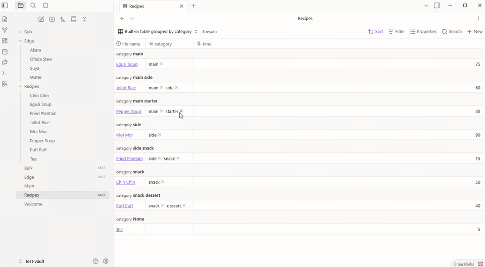

# Split Groups

A view for Obsidian Bases that puts a note in **every** group its list property names.

Group a Base by a list property today and a recipe with `category: [main, side]` lands in one combined group called "main, side". With Split Groups it appears under **main** and again under **side**, which is what most people expect. This is the behaviour asked for in the forum thread [Make a note fall into multiple groups](https://forum.obsidian.md/t/bases-group-by-sorting-improvement-make-a-note-fall-into-multiple-groups/107097).



## Use it

1. Open a Base, open the view menu and add a view of type **Split groups**.
2. In the view options, set **Split by** to the list property to group on.
3. Pick **Table** or **List** under **Layout**. Columns come from the view's properties, as in any Base.
4. Optional: set **Then split by** to a second list property, and every group splits again inside (for example Genre, then Status).
5. Optional: pick a note under **Template for +**, and new notes made in this view (with a group's **+** or the toolbar's **New**) start from it.

## How values are grouped

- Every item in a list gets its own group. A single value works too.
- `Main`, `main` and ` main ` are one group, shown with the spelling seen first.
- Links group by the note they point to: `[[Main]]`, `[[Recipes/Main.md]]`, `[[Main|Main dish]]` and plain `main` share a group.
- A tag's leading `#` is dropped.
- The same value twice in one note counts once.
- Notes with nothing in the property go to **(no value)** at the end. Turn that off with **Show notes with no value**.
- Groups sort by name, numbers naturally (2 before 10). Notes inside a group keep the Base's own sort.
- **Sort groups** in the view options: A → Z, Z → A, **Most notes first** or **Fewest notes first** (ties go by name). **(no value)** stays last either way.
- Click a group's heading to fold it. Folded groups stay folded when notes change, and each view remembers its own. **Collapse all** and **Expand all** sit above the groups.
- The **+** on a heading makes a new note with that group's value filled in. On a sub-group it fills in both values. With a template chosen, the note is made from it (see below).
- Until a property is chosen under **Split by**, the view shows all its notes in one list.
- Obsidian's own **Group by** (under Sort) has no effect on a Split groups view. Use **Split by** instead.

If you turn the plugin off, Split groups views show "Unknown view type" until you turn it back on or switch that view to Table. Your notes are never changed.

Click a note to open it, Ctrl or Cmd click (or middle click) for a new tab, and Ctrl or Cmd hover for a preview.

## New notes from a template

Pick a note under **Template for +** in the view options. The **+** on a group heading then makes the new note from that template, with the group's value filled in. The toolbar's **New** in that view uses the same template, without a group value. This is the ask in the forum thread [Bases: New With Template](https://forum.obsidian.md/t/bases-new-with-template-for-new-button/102639), for Split groups views.

- The template's properties are added to the note. For the property you split by, the group wins: a template with `category: [uncategorised]` under **main** gives `category: [main]`. Values the Base fills in from its filters are kept.
- The template's body goes in under the properties. `{{title}}`, `{{date}}` and `{{time}}` are filled in like Obsidian's own Templates, and so are `{{date:FORMAT}}` and `{{time:FORMAT}}`.
- If the template uses Templater (`<% %>`) and Templater is installed, Templater fills it in.
- Each view has its own template, so one Base can have a different one per view.
- Only Split groups views use the template. **New** in a Table, Cards or List view is not changed.
- If the template note has been moved or deleted, the note is made blank and a message says so.

## Try it

`test-vault` is a small vault with recipes and edge cases (links, case, duplicates, empty lists, numbers). Open it in Obsidian, build the plugin, and open `Recipes.base` or `Edge.base`. The **Category then diet** view uses `Templates/Recipe.md` for its **+**. `npm run bulk` adds 3,000 generated notes and `Bulk.base` for a speed check.

## Build

```
npm install
npm run build   # type checks, bundles main.js, copies it into test-vault
npm test        # unit tests for the grouping rules
```

## Licence

MIT, Fuad Laguda.
